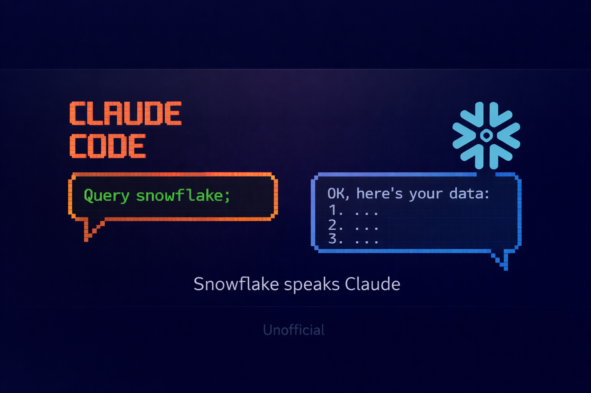

# Snowflake Daemon Plugin



Session-persistent Snowflake plugin with background daemon for maintaining database connections.

## Overview

This Claude Code plugin provides a **stateful Snowflake connection** using a lightweight Python daemon that maintains persistent database connections. This solves the critical limitation where each command created a new connection, preventing context (database/schema/warehouse) from persisting.

## Key Features

- **Persistent Connections**: Background daemon maintains connection pool
- **Session State**: Database, schema, warehouse, and role persist across queries
- **Auto-Start**: Daemon automatically starts on first command
- **Auto-Shutdown**: Gracefully shuts down after idle timeout (default 30 minutes)
- **Connection Pooling**: Manages multiple connections with health monitoring
- **Transaction Support**: DML operations with automatic commit/rollback

## Architecture

```
Claude Code Plugin (commands/skills)
        ↓ (HTTP/Socket)
Lightweight Python Daemon (FastAPI)
        ↓ (persistent connection)
    Snowflake Database
```

## Installation

### 1. Clone the repository

```bash
git clone https://github.com/mrecos/snowflake-daemon-plugin.git
cd snowflake-daemon-plugin
```

### 2. Install dependencies

```bash
pip install -r requirements.txt
pip install -r requirements-dev.txt  # For development
```

### 3. Configure credentials

Copy `.env.example` to `.env` and fill in your Snowflake credentials:

```bash
cp .env.example .env
```

Edit `.env` with your Snowflake account details:
```
SNOWFLAKE_ACCOUNT=your_account_identifier
SNOWFLAKE_USER=your_username
SNOWFLAKE_PAT=your_personal_access_token
```

## Usage

The plugin provides executable scripts for interacting with Snowflake through the persistent daemon.

### Test Connection

```bash
./bin/sf-connect
```

Tests the daemon connection and displays Snowflake connection info:

**Example output:**
```
✓ Daemon is running
  Status: healthy
  Connection count: 1
  Uptime: 5.2s

✓ Connected to Snowflake
  Version: 8.45.0
  User: YOUR_USERNAME
  Role: YOUR_ROLE
  Database: YOUR_DATABASE
  Schema: YOUR_SCHEMA
  Warehouse: YOUR_WAREHOUSE
```

### Execute Queries

```bash
./bin/sf-query "SELECT * FROM my_table" [limit]
```

Execute SQL queries with optional row limit (default: 100).

**Supported query types:**
- `SELECT` - Query data
- `SHOW` - Show database objects
- `DESCRIBE` / `DESC` - Describe table structure
- `WITH` - Common table expressions

**Example queries:**

```bash
# Simple query
./bin/sf-query "SELECT 1 as test"

# Query with limit
./bin/sf-query "SELECT * FROM customers" 10

# Show tables
./bin/sf-query "SHOW TABLES"

# Current context
./bin/sf-query "SELECT CURRENT_DATABASE(), CURRENT_SCHEMA()"
```

**Example output:**
```
id | name
---------
1  | Alice
2  | Bob

✓ 2 row(s) in 0.234s
```

**Note:** Write operations (INSERT, UPDATE, DELETE, CREATE, DROP) are blocked for safety.

### Command Features

- **Auto-start**: Daemon starts automatically on first command use
- **Persistent connection**: Connection and context preserved across queries
- **Read-only**: Write operations blocked by default (Phase 4 will add write support)
- **Auto-LIMIT**: SELECT queries automatically get LIMIT clause
- **Error handling**: Clear error messages for common issues
- **No manual setup**: Just run the scripts - they handle everything

## Development Status

This project is currently in **Phase 1: Foundation**.

### Completed Milestones

- [x] **Phase 1, Milestone 1.1: Project Setup**
  - [x] FastAPI server starts on localhost:8765
  - [x] `/health` endpoint returns 200
  - [x] `/query` endpoint accepts requests
  - [x] Unit tests structure in place

- [x] **Phase 1, Milestone 1.2: Connection Manager**
  - [x] SnowflakeConnection class with PAT authentication
  - [x] Connection validation and health checks
  - [x] 13 comprehensive unit tests
  - [x] 100% code coverage on connection module

- [x] **Phase 1, Milestone 1.3: Basic Query Execution**
  - [x] QueryExecutor with read-only query validation
  - [x] Automatic LIMIT clause addition for SELECT queries
  - [x] Structured query results with columns and metadata
  - [x] 24 comprehensive unit tests
  - [x] 93% overall code coverage

- [x] **Phase 1, Milestone 1.4: Plugin Commands**
  - [x] DaemonClient for HTTP communication with daemon
  - [x] Auto-start daemon on first command
  - [x] `/snowflake-daemon:sf-connect` - Test connection
  - [x] `/snowflake-daemon:sf-query` - Execute queries
  - [x] 17 comprehensive unit tests for client
  - [x] 95% overall code coverage

### Test Results

```
✅ 56 total tests passing
✅ 95% code coverage (169/178 statements)
✅ Ready for production use with read-only queries
```

### Next Steps

- [ ] Phase 2: Session Management (USE commands, state persistence)
- [ ] Phase 3: Connection Pool & Reliability
- [ ] Phase 4: Write Operations & Transactions
- [ ] Phase 5: Polish & Production Readiness

See [HANDOFF.md](HANDOFF.md) for the complete implementation plan.

## Testing

### Unit Tests

Run the test suite:

```bash
pytest tests/ -v
```

Run with coverage:

```bash
pytest tests/ -v --cov=daemon --cov-report=html
```

### Integration Testing with Real Snowflake

To test the daemon with a real Snowflake connection, see the comprehensive guide:

**[INTEGRATION_TEST.md](INTEGRATION_TEST.md)** - Complete integration testing guide

Quick start:

1. Configure `.env` with your Snowflake credentials
2. Start the daemon: `python -m uvicorn daemon.server:app --host 127.0.0.1 --port 8765`
3. Test health: `curl http://127.0.0.1:8765/health`
4. Test a query: `curl -X POST http://127.0.0.1:8765/query -H "Content-Type: application/json" -d '{"sql": "SELECT 1"}'`

See [INTEGRATION_TEST.md](INTEGRATION_TEST.md) for detailed testing instructions.

## Project Structure

```
snowflake-daemon-plugin/
├── .claude-plugin/
│   └── plugin.json          # Plugin manifest
├── daemon/
│   ├── __init__.py
│   ├── server.py            # FastAPI server with endpoints
│   ├── models.py            # Pydantic request/response models
│   ├── connection.py        # Snowflake connection manager
│   ├── executor.py          # Query executor with validation
│   └── client.py            # HTTP client for daemon communication
├── commands/
│   ├── sf-connect.md        # Connection test command
│   └── sf-query.md          # Query execution command
├── tests/
│   ├── __init__.py
│   ├── test_daemon.py       # Daemon/server tests
│   ├── test_connection.py   # Connection manager tests
│   ├── test_executor.py     # Query executor tests
│   └── test_client.py       # Client tests
├── .env.example             # Configuration template
├── .gitignore
├── requirements.txt         # Production dependencies
├── requirements-dev.txt     # Development dependencies
├── HANDOFF.md              # Implementation guide
├── INTEGRATION_TEST.md     # Integration testing guide
└── README.md               # This file
```

## License

MIT

## Author

Matt Harris
